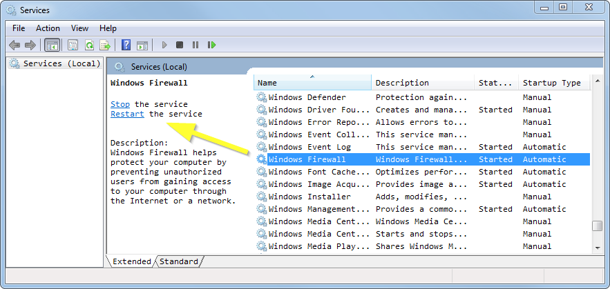

# Start and Stop/Restart PLM

PLM runs as a regular 'Windows service' called `Assembléon PLM`. It can be [started and stopped/restarted accordingly](../general/windows/services/startStopRestart.md):

